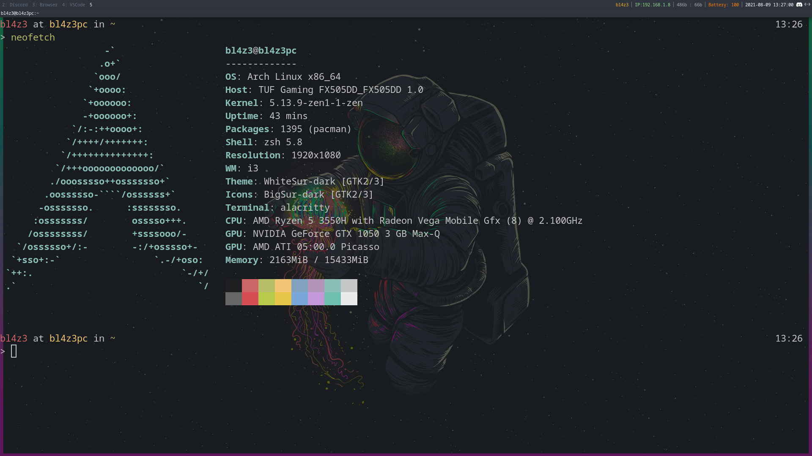

# Dotfiles

What's this? These are my dotfiles for i3, i3blocks and alacritty.

# How to get this?

Just run-

    git clone https://github.com/gopal-kaul/dotfiles ~/

# Requirements-
- i3 (or i3-gaps)
- scrot
- xclip (for screenshots)
- i3blocks (for the bar on top)
- alacritty (for the terminal)

# Sample Screenshot- 

